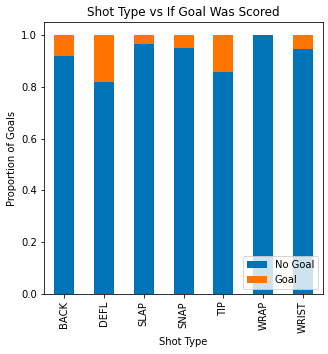

# expectedGoalsModel
<h1>NHL Expected Goals Model</h1>

Using logistic regression to build an expected goals model to predict the probability that a goal is scored in the National Hockey League. The model takes a variety of factors and then mathematically assigns a number to each shot attempt. The data for this model covers shot attempts from the 2021 NHL season excluding shots that were taken on an empty net. Thank you <a href = "moneypuck.com">Money Puck</a> for making this data available. 

<h2>Model Features</h2>
<ul>
    <li>Shot Type: Slap Shot, Snap Shot, Wrist Shot, Deflected, Tip-In, Wrap-Around, Backhand.</li>
    <li>Off Wing: If the player took the shot from their off wing.</li>
    <li>Distance: Distance of shot from the net.</li>
    <li>Shot Angle: Angle of the shot.</li>
    <li>Time Since Last Event: The difference in time from the last event.</li>
    <li>Distance Change: Distance from the last event</li>
</ul>
<h2>Evaluating the Features</h2>

You can see the code being run .

