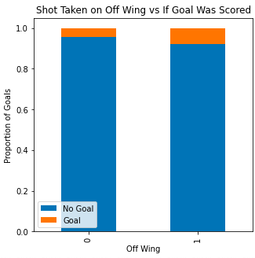

# expectedGoalsModel
<h1>NHL Expected Goals Model</h1>

Using logistic regression to build an expected goals model to predict the probability that a goal is scored in the National Hockey League. The model takes a variety of factors and then mathematically assigns a number to each shot attempt. The data for this model covers shot attempts from the 2021 NHL season excluding shots that were taken on an empty net. Thank you <a href = "moneypuck.com">Money Puck</a> for making this data available. 

<h2>Model Features</h2>
<ul>
    <li>Shot Type: Slap Shot, Snap Shot, Wrist Shot, Deflected, Tip-In, Wrap-Around, Backhand.</li>
    <li>Off Wing: If the player took the shot from their off wing.</li>
    <li>Distance: Distance of shot from the net.</li>
    <li>Shot Angle: Angle of the shot.</li>
    <li>Time Since Last Event: The difference in time from the last event.</li>
    <li>Distance Change: Distance from the last event</li>
</ul>
<h2>Evaluating the Features</h2>

Here you can see that proportionately deflections and tips score at a high rate, and wraparounds rarely result in goals.

Off wing shots have a better chance of scoring.

Here you can see that the closer you are to the net the more likely you are going to score.

From this shot angle bar graph you can see that 

Shot angle is not as predictive as 

Shot angle is not as predictive as 

<h2>Training and Testing</h2>

I built a logistic regression classifier with the shot data and features selected. The classifier was trained on a random portion of the data, and then tested on a different random portion. 

The data being used is shot attempts from the 2021 NHL season. The data was shuffled and then split into training and testing sets. 70% of the data was used for training the classifier, and 30% for testing. 

The model was then tested on the test set. Using the model to calculate the probability of each shot in the test set, I calculated the area underneath the ROC curve to evaluate the predictions made by the model. See below. 

The AUC score is a value between 1 and 0, with a score closer to 1 being better. A line that reaches to the top left corner of the graph represents a higher AUC score, and the straight, dashed line through the middle of the graph represents a completely random prediction.

A confusion matrix of the data, shown above, tells us the accuracy of the model. 0 indicates a non goal and 1 indicates a goal. The X-axis is what the model predicted the outcome to be, and the Y-axis represents what actually happened.

This final bar graph is a representation of the features in the model. A larger bar means that it had a greater impact on the prediction. A bar facing left better predicts non goals, and a bar facing right better predicts goals. This shows that off wing and shot type were most important for predicting goals. For predicting non goals, shot distance and shot angle were most important.

You can see the code being run .

